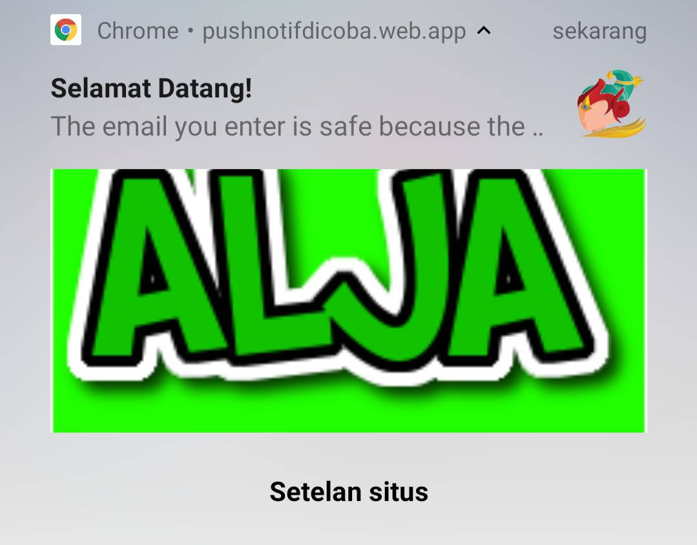

# Prototype Send and Receive Messager Notification (FCM)

## Deploy and Test
- Set up firebase project
- Enable Google Provider in the Auth Section (this for login admin sending messager)
- Clone or download this repo
- Must already have the Firebase CLI installed. If you don't have it, install it with `npm install -g firebase-tools` and then configure it with `firebase login` more information visit [Referensi Firebase CLI](https://firebase.google.com/docs/cli)
- Configure the CLI locally by using `firebase use --add` and select firebase project in the list
- Install dependencies locally by running: `cd functions` -> `npm install` and then back to list this project file
- Deploy your project using `firebase deploy`
- After deploy, copy link site and open in browser

In this prototype there are two pages:

1. The first is rooted for user pages
1. And the second is for admin pages that send messages to users who have allowed notifications (adding ../sendMessaging.html in the link)

## Sample Database Structure using Realtime Database
```
/notifications
  /<uniqueTokenCode>
    icon: "https://www.freepngimg.com/thumb/bell/36705-8-bell.png"
    image: "https://......"
    message: "BlaBla"
    title: "BlaBla"
    user: "Bla Jhonson Bla"
 /tokens
  /<uniqueTokenCode>
    token: "BHYAH8y8hadfhU9x...n++"
```

<i>Database Structure for Sending to Device Token is Saved : `/notifications/{notificationId}`</i>


### Receive notification messages:

